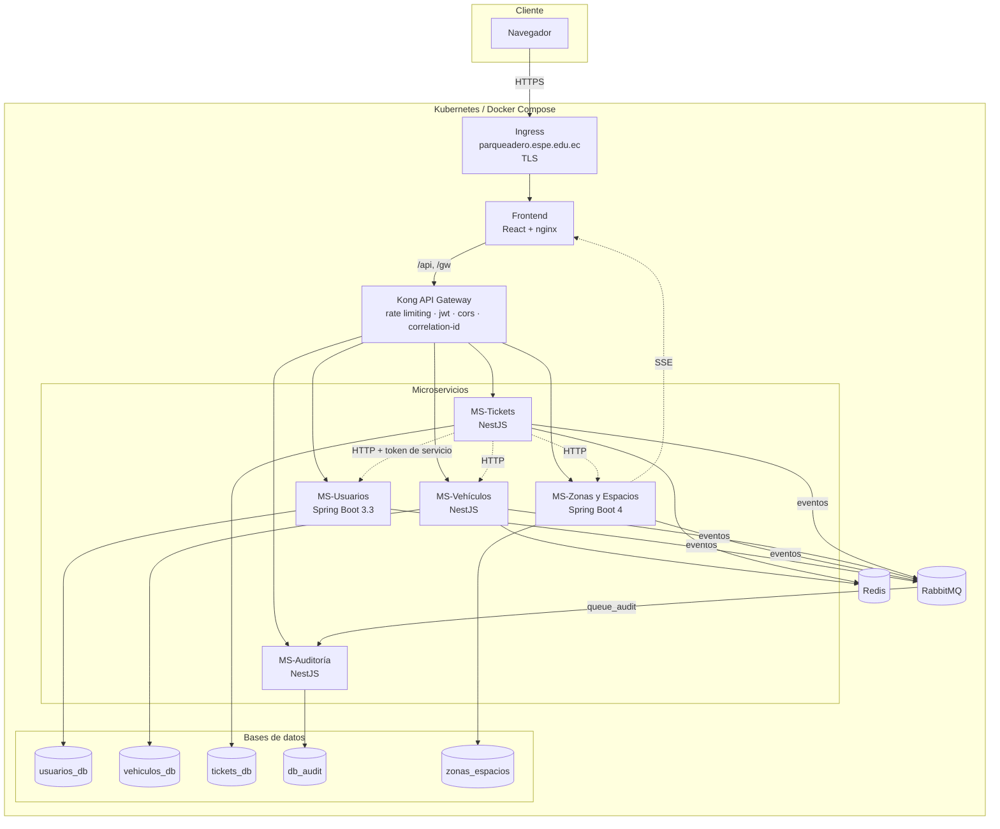
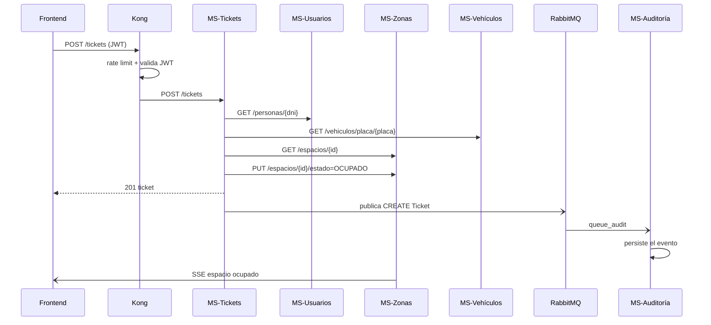

# Arquitectura — ParkingApp SaaS Multitenant

Este documento explica **por qué** el sistema está construido así. Para
levantarlo, ver el [README](../../README.md); para el despliegue en Kubernetes,
[k8s/README.md](../../k8s/README.md); para el detalle del aislamiento entre
empresas, [MULTITENANT.md](MULTITENANT.md).

---

## 1. Vista general



---

## 2. Decisiones de diseño

### 2.1. Una base de datos por microservicio

Cada servicio es dueño de su esquema y nadie lee las tablas de otro: la
comunicación es siempre por HTTP o por eventos. `ms-zonas-espacios` usa MySQL y
el resto PostgreSQL, lo que además demuestra que la independencia es real y no
solo de nombre.

En el clúster hay **una instancia** de PostgreSQL con cuatro bases. El
aislamiento de esquema se mantiene; compartir el motor solo ahorra recursos.
Separarlos en cuatro StatefulSets es cambiar cuatro líneas de YAML.

### 2.2. Multitenancy por discriminador, no por esquema ni por instancia

Las tres estrategias posibles eran:

| Estrategia | Aislamiento | Coste por tenant | Alta de un tenant |
|---|---|---|---|
| Instancia por tenant | Máximo | Muy alto | Redesplegar |
| Esquema por tenant | Alto | Medio | Migración de BD |
| **Discriminador (`tenant_id`)** | Lógico | Nulo | **Un INSERT** |

Se eligió la tercera porque el enunciado exige que *"nuevos tenants sean
incorporados sin redistribuir la aplicación"*. Con las otras dos, dar de alta
una empresa obliga a tocar la infraestructura.

El precio a pagar es que el aislamiento depende del código, no del motor. Por
eso el `tenantId` **solo** se lee del claim del JWT: ningún endpoint lo acepta
como parámetro, porque sería falsificable. La única excepción es la cabecera
`X-Tenant-Id` en llamadas entre servicios, y solo se acepta cuando el token
tiene rol `SERVICE`.

### 2.3. Comunicación síncrona vs. asíncrona

**Síncrona (HTTP)** cuando la respuesta condiciona la operación: `ms-tickets`
no puede emitir un ticket sin confirmar que la persona existe, que el vehículo
está registrado y que el espacio está libre. Si algo de eso falla, el ticket no
debe existir.

**Asíncrona (RabbitMQ)** para la auditoría, que es un efecto colateral. Si
`ms-audit` está caído, el parqueadero tiene que seguir funcionando: los eventos
se acumulan en la cola y se procesan al volver. Hacerla síncrona convertiría al
servicio de auditoría en un punto único de fallo de todo el sistema.



### 2.4. Topología de RabbitMQ

```
exchange_audit (topic, durable)
   └── routing_audit ──> queue_audit (durable)
                            └── x-dead-letter-exchange ──> exchange_audit.dlx (fanout)
                                                              └── queue_audit.dlq
```

Un evento que no se puede procesar (DTO inválido, error al persistir) se
rechaza **sin reencolar** y acaba en la cola muerta. Reencolarlo crearía un
bucle infinito que ahogaría al consumidor; perderlo silenciosamente rompería la
trazabilidad que exige el enunciado. La DLQ es el punto medio.

La topología la declara cada servicio al arrancar (`assertExchange` /
`assertQueue`), no un `definitions.json` en la imagen: así hay una única fuente
de verdad y el orden de arranque deja de importar.

### 2.5. El gateway valida, pero no es la única barrera

Kong aplica el plugin `jwt` en `/vehiculos`, `/tickets` y `/api/audit`, que son
rutas 100 % autenticadas. **No** lo aplica en `/api/auth`, `/api/oauth`,
`/api/users` ni en los GET de zonas y espacios, porque ahí conviven endpoints
públicos (login, registro, selector de empresas, dashboard de monitoreo) con
endpoints protegidos; el control fino lo hace el `SecurityConfig` de cada
servicio.

Los microservicios **siguen validando el token** aunque Kong ya lo haya hecho.
Si Kong dejara de ser el único camino de entrada —un pod comprometido, un
port-forward— la autorización no se evaporaría con él.

Para `ms-audit`, que no tiene guard propio, Kong es hoy la única barrera. Está
señalado como tal en `kong.yml`.

### 2.6. Redis: caché con nombres de tenant

`ms-vehiculos` y `ms-tickets` cachean lo que consultan a otros servicios en cada
operación: vehículos por placa, espacios por id, personas por DNI y la
configuración de la empresa. Todas las claves llevan el tenant delante:

```
t:{tenantId}:vehiculo:{placa}
t:{tenantId}:espacio:{id}
t:{tenantId}:persona:{dni}
t:{tenantId}:config
```

Sin ese prefijo, dos empresas con la misma placa —que es legal, la unicidad es
por tenant— se pisarían mutuamente el caché. Sería una fuga de datos entre
empresas por la puerta de atrás.

Si Redis no está disponible el servicio **sigue funcionando** sin caché
(`enableOfflineQueue: false` y captura del evento `error`): el caché acelera,
no habilita.

### 2.7. SSE y por qué `zonas-espacios` no escala horizontalmente

El stream `/api/espacios/stream` mantiene en memoria del pod la lista de
emisores conectados. Con dos réplicas, un cliente conectado al pod A no vería
los cambios que procesa el pod B.

Por eso ese Deployment tiene `replicas: 1`, estrategia `Recreate` y **no** tiene
HPA, con el motivo escrito en el propio manifiesto. Escalarlo exige antes mover
el fan-out a Redis pub/sub o dar a cada instancia su propia cola de RabbitMQ.
Es una limitación conocida y acotada, no un descuido.

El SSE además atraviesa tres proxies y cada uno bufferiza por defecto. Las tres
piezas que hay que desactivar:

| Capa | Ajuste |
|---|---|
| Ingress | `nginx.ingress.kubernetes.io/proxy-buffering: "off"` + timeouts de 24 h |
| nginx del frontend | `location /api/espacios/stream` con `proxy_buffering off` |
| Kong | `response_buffering: false` en la ruta |

### 2.8. Kong en modo DB-less

La configuración del gateway vive en `App/kong.yml` y se hornea en la imagen
(`docker/kong/Dockerfile`). Sin base de datos, sin panel de administración con
estado y sin deriva entre entornos: la misma imagen enruta igual en compose que
en Kubernetes. Cambiar una ruta es reconstruir la imagen y hacer
`rollout restart`, que es justo lo que hace el pipeline.

---

## 3. Seguridad

| Capa | Qué protege |
|---|---|
| Ingress | TLS y redirección a HTTPS |
| Kong | Rate limiting (600/min global, 120/min en el servicio del login), validación de JWT, CORS |
| Microservicio | RBAC por endpoint y filtrado por `tenant_id` |
| Base de datos | Credenciales desde Secrets de Kubernetes, nunca en el código |

**JWT**: HS256, emitido solo por `ms-usuarios`. Claims: `sub` (username),
`userId`, `roles`, `tenantId` (ausente en `superadmin` y en la cuenta de
servicio) e `iss`. Kong empareja `iss` con la credencial del consumidor, por eso
hay una credencial por cada valor posible de `JWT_ISSUER`.

**Contraseñas**: BCrypt. Los tokens de recuperación se guardan como hash
SHA-256, son de un solo uso y caducan a los 30 minutos; pedir un enlace nuevo
invalida el anterior. El endpoint devuelve siempre el mismo mensaje exista o no
el correo, para no convertirse en un oráculo de correos registrados.

**Roles**: `SUPER_ADMIN` (global, gestiona empresas), `ADMIN` (de una empresa),
`OPERATOR`, `CLIENT` y `SERVICE` (llamadas máquina-a-máquina).

---

## 4. Escalabilidad

| Componente | Réplicas | HPA | Motivo |
|---|---|---|---|
| `tickets` | 2–10 | CPU 70 % + memoria 80 % | Orquesta tres servicios; es el primero en saturarse |
| `usuarios` | 2–6 | CPU 60 % | BCrypt del login es caro a propósito; la latencia sube antes |
| `vehiculos` | 2–6 | CPU 75 % | CRUD con caché |
| `ms-audit` | 2–8 | CPU 75 % | Consumidores en competencia sobre la misma cola |
| `kong` | 2–6 | CPU 70 % | Punto de entrada |
| `frontend` | 2–6 | CPU 80 % | Estáticos |
| `zonas-espacios` | 1 | — | Los emisores SSE viven en memoria del pod |
| Bases de datos | 1 | — | Todas las réplicas montarían el mismo PVC `ReadWriteOnce` |

Añadir una empresa **no toca la infraestructura**: es un `INSERT` en `tenants`
más los usuarios que se registren. Esa es la propiedad que justifica toda la
estrategia multitenant elegida.

---

## 5. Limitaciones conocidas

Cosas que un despliegue real exigiría y que aquí están acotadas a propósito:

1. **`zonas-espacios` no escala** mientras el fan-out del SSE siga en memoria.
2. **`ms-audit` no valida el JWT por sí mismo**: depende de Kong. Si se expone
   por otro camino, queda abierto.
3. **Rate limiting `policy: local`**: el contador es por pod, así que con N
   réplicas de Kong el límite efectivo se multiplica por N. Compartirlo en
   Redis crearía una dependencia dura del gateway hacia Redis.
4. **Sin servidor SMTP**: el token de recuperación se escribe en el log. El
   punto de enganche para un `JavaMailSender` está aislado en un solo método.
5. **`ddl-auto=update`**: cómodo en desarrollo, insuficiente en producción. Lo
   correcto sería Flyway o Liquibase con migraciones versionadas.
6. **Sondas TCP en vez de HTTP**: ningún servicio expone un `/health`, y una
   ruta real devolvería 401 detrás del filtro JWT.
