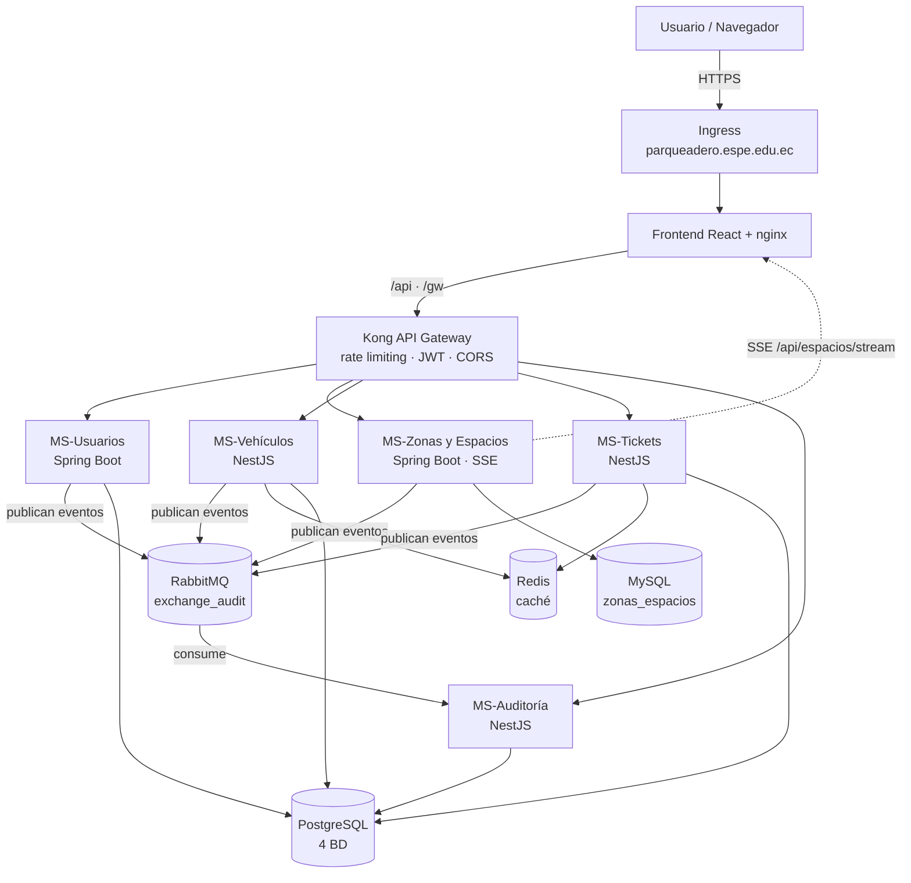

# ParkingApp — Sistema de Gestión de Parqueaderos SaaS Multitenant

Plataforma de gestión de parqueaderos bajo arquitectura de microservicios y
modelo **SaaS multitenant**: varias empresas (tenants) operan de forma
independiente sobre una única infraestructura compartida, con sus datos y su
configuración aislados.

> Proyecto de integración — Arquitectura de Software, ESPE.
> Autora: Mishell Estefanía Cuasquer Chisaguano.

[](https://github.com/MishellCuasquer/PARKING-PIII/actions/workflows/java-ci.yml)
[](https://github.com/MishellCuasquer/PARKING-PIII/actions/workflows/node-ci.yml)
[](https://github.com/MishellCuasquer/PARKING-PIII/actions/workflows/sonar.yml)

---

## 1. Arquitectura en un vistazo



Documento completo, con el detalle de cada componente y las decisiones de
diseño: **[docs/ARQUITECTURA.md](ParkingApp/docs/ARQUITECTURA.md)**.

### Microservicios

| Servicio | Stack | Puerto | Base de datos | Responsabilidad |
|---|---|---|---|---|
| `ms-usuarios-roles-auth` | Spring Boot 3.3 / Java 21 | 8080 | PostgreSQL `usuarios_db` | Usuarios, roles, empresas, emisión de JWT, recuperación de contraseña |
| `ms-zonas-espacios` | Spring Boot 4 / Java 21 | 8081 | MySQL `zonas_espacios` | Zonas, espacios, estados de ocupación y stream SSE |
| `ms-vehiculos` | NestJS 11 | 3000 | PostgreSQL `vehiculos_db` | CRUD de vehículos y tipos |
| `ms-tickets` | NestJS 11 | 3002 | PostgreSQL `tickets_db` | Entrada, salida y cobro según la tarifa de cada empresa |
| `ms-audit` | NestJS 11 | 3004 | PostgreSQL `db_audit` | Consume `queue_audit` y persiste la trazabilidad |

### Infraestructura

| Componente | Imagen | Puerto | Para qué |
|---|---|---|---|
| Kong | propia (`docker/kong/Dockerfile`) | 8000 / 8001 | API Gateway: enrutamiento, rate limiting, validación JWT, CORS |
| RabbitMQ | propia (`docker/rabbitmq/Dockerfile`) | 5672 / 15672 | Broker de eventos de dominio |
| Redis | `redis:7-alpine` | 6379 | Caché de vehículos, espacios, personas y configuración de tenant |
| PostgreSQL | `postgres:16` | 5432 | 4 bases, una por microservicio |
| MySQL | `mysql:8` | 3306 | Base de zonas y espacios |

---

## 2. Manual de despliegue

### 2.1. Local con Docker Compose

Requisitos: Docker Desktop y ~6 GB de RAM libres.

```bash
git clone https://github.com/MishellCuasquer/PARKING-PIII.git
cd PARKING-PIII/ParkingApp

docker compose up -d --build

# Seguir el arranque (los servicios Java tardan ~40s)
docker compose ps
docker compose logs -f usuarios
```

| Qué | Dónde |
|---|---|
| Frontend | http://localhost:5173 |
| Dashboard de monitoreo | http://localhost:8090 |
| API Gateway (Kong) | http://localhost:8000 |
| Kong Admin | http://localhost:8001 |
| RabbitMQ Management | http://localhost:15672 (`admin` / `admin123`) |
| Swagger de tickets | http://localhost:3002/api |
| Swagger de vehículos | http://localhost:3000/api |
| Swagger de auditoría | http://localhost:3004/docs |
| Swagger de usuarios | http://localhost:8080/swagger-ui.html |
| Swagger de zonas | http://localhost:8081/swagger-ui.html |

**Cuentas semilla**

| Usuario | Contraseña | Rol | Empresa |
|---|---|---|---|
| `superadmin` | `superadmin123` | SUPER_ADMIN | — (global) |
| `admin` | `admin123` | ADMIN | Parqueadero Default |
| `operador` | `operador123` | OPERATOR | Parqueadero Default |
| `cliente` | `cliente123` | CLIENT | Parqueadero Default |

**Datos de prueba**

```bash
npm run seed:tarifas      # una tarifa distinta por empresa (demo multitenant)
npm run seed:vehiculos
npm run seed:tickets
```

`seed:tarifas` deja cada empresa con su propio precio, que es lo que demuestra
el modelo SaaS. **Toda la plataforma opera en dólares (USD).**

| Empresa | Código | Tarifa/hora | Horario |
|---|---|---|---|
| Parqueadero Default | `DEFAULT` | 1.00 USD | 00:00–23:59 |
| Parqueadero Norte | `NORTE` | 1.50 USD | 06:00–22:00 |
| Parqueadero Sur | `SUR` | 2.00 USD | 07:00–21:00 |
| Parqueadero Centro | `CENTRO` | 2.50 USD | 05:30–23:00 |

**Una empresa nueva nace con 1.00 USD/hora y horario 00:00–23:59** si no se le
indica otra cosa al crearla.

El cobro es **proporcional a la fracción**, con un mínimo de una hora: quien se
queda hora y media paga hora y media, no dos horas. Lo único que se redondea es
el importe final, a céntimos. En el parqueadero por defecto (1.00 USD/h):

| Permanencia | Se cobra |
|---|---|
| 10 min | 1.00 USD (mínimo de 1 hora) |
| 1 h | 1.00 USD |
| 1 h 30 min | 1.50 USD |
| 2 h 30 min | 2.50 USD |
| 3 h 20 min | 3.33 USD |

**Apagar**

```bash
docker compose down          # conserva los datos
docker compose down -v       # borra también los volúmenes
```

> Al cambiar de versión conviene `down -v`. Hibernate corre con
> `ddl-auto=update`: añade columnas nuevas pero **no** elimina los índices
> únicos viejos. El detalle y el SQL de migración manual están en
> [docs/MULTITENANT.md](ParkingApp/docs/MULTITENANT.md).

### 2.2. Kubernetes

Los manifiestos están en [`k8s/`](k8s/), con su propio
[README](k8s/README.md) (orden de aplicación, secrets de producción,
verificación y problemas frecuentes).

```bash
# Prerrequisitos: Ingress controller nginx + metrics-server
kubectl apply -f k8s/

kubectl -n parqueadero rollout status statefulset/postgres
kubectl -n parqueadero get pods,svc,ingress,hpa
```

El frontend queda expuesto en **https://parqueadero.espe.edu.ec** y el gateway
en **https://api.parqueadero.espe.edu.ec**.

### 2.3. Pipeline de CI/CD

| Workflow | Cuándo | Qué hace |
|---|---|---|
| `java-ci.yml` | push / PR | Compila y prueba los 2 microservicios Java (checkstyle + JaCoCo) |
| `node-ci.yml` | push / PR | Lint, build y tests con cobertura de los 3 microservicios NestJS |
| `sonar.yml` | push / PR | Cobertura de los 5 servicios y análisis en SonarCloud |
| `docker-publish.yml` | push a main / PR | Construye las 9 imágenes; publica en `ghcr.io` solo desde main |
| `deploy-k8s.yml` | cambios en `k8s/` o manual | Valida los manifiestos y despliega en el clúster |
| `notify-telegram.yml` | al terminar los anteriores | Avisa del resultado en Telegram |

**Secretos que hay que configurar** en *Settings → Secrets and variables → Actions*:

| Secreto | Para qué | Obligatorio |
|---|---|---|
| `SONAR_TOKEN` | Análisis de SonarCloud | Sí |
| `TELEGRAM_BOT_TOKEN` | Notificaciones ([guía](ParkingApp/docs/telegram-bot-setup.md)) | Recomendado |
| `TELEGRAM_CHAT_ID` | Notificaciones | Recomendado |
| `KUBE_CONFIG` | kubeconfig en base64 para desplegar | Solo para desplegar |

Sin `KUBE_CONFIG`, `deploy-k8s.yml` no falla: valida los manifiestos y avisa de
que no hay clúster configurado.

---

## 3. Manual de operación

### Multitenancy

Cada **tenant** es una empresa. El aislamiento es lógico: todas las consultas
filtran por `tenant_id`, que sale del claim `tenantId` del JWT y **nunca** de un
parámetro de la petición. Una misma persona puede tener cuenta en varias
empresas y cambiar entre ellas sin volver a autenticarse.

Detalle completo (unicidad por tenant, caché, llamadas entre servicios, demo de
aislamiento): [docs/MULTITENANT.md](ParkingApp/docs/MULTITENANT.md).

### Configuración por empresa

Cada empresa fija su **tarifa por hora**, su **moneda** y su **horario**
(pantalla *Empresas*, solo `SUPER_ADMIN`). `ms-tickets` lee esa configuración al
cerrar cada ticket vía `GET /api/tenants/{id}/configuracion`, la cachea 5
minutos en Redis y, si `ms-usuarios` no responde, cae a `TARIFA_HORA`. Cerrar un
ticket es una operación de caja y no puede quedar bloqueada.

Las zonas, los espacios y sus capacidades ya son por empresa: se crean dentro
del tenant del usuario que los da de alta.

### Recuperación de contraseña

1. *Login → ¿Olvidaste tu contraseña?* → se introduce el correo.
2. El backend emite un token de un solo uso (30 min) **por cada cuenta** con ese
   correo. En base de datos solo queda su hash SHA-256.
3. Se pega el token, se fija la contraseña nueva y el token se consume.

No hay servidor SMTP: el token se escribe en el log de `ms-usuarios`. En local,
`PASSWORD_RESET_EXPONER_TOKEN=true` hace que además venga en la respuesta y la
pantalla lo rellene sola. **En producción se deja en `false`.**

```bash
docker compose logs usuarios | grep "Token de recuperación"
```

### Auditoría

Los cuatro microservicios de negocio publican en el exchange `exchange_audit`
(topic) y `ms-audit` consume `queue_audit`. Los mensajes que fallan van a
`queue_audit.dlq` en vez de perderse.

```bash
# Profundidad de las colas: si queue_audit crece, la auditoría va por detrás
docker compose exec rabbitmq rabbitmqctl list_queues name messages
```

### Tiempo real (SSE)

`GET /api/espacios/stream` empuja cada cambio de estado de un espacio. Cada
evento lleva su `idTenant` y el frontend solo atiende los de su empresa.
Las tres piezas que lo hacen posible —y que se rompen fácil— son:
`response_buffering: false` en Kong, el `location` sin buffering del nginx del
frontend y las anotaciones `proxy-buffering: off` del Ingress.

### Comprobaciones rápidas

```bash
# Kong ve sus rutas
curl -s localhost:8001/routes | jq '.data[].name'

# El rate limiting está activo (cabeceras X-RateLimit-*)
curl -sI localhost:8000/api/zonas | grep -i ratelimit

# El gateway rechaza tráfico sin token en las rutas protegidas
curl -s -o /dev/null -w '%{http_code}\n' localhost:8000/tickets   # 401

# Redis está cacheando por tenant
docker compose exec redis redis-cli keys 't:*'
```

---

## 4. Estructura del repositorio

```
PARKING-PII/
├── .github/workflows/        # CI/CD: build, tests, Sonar, imágenes, despliegue, Telegram
├── k8s/                      # Manifiestos de Kubernetes (+ README propio)
└── ParkingApp/
    ├── App/
    │   ├── kong.yml                    # Configuración declarativa del gateway
    │   ├── ms-usuarios-roles-auth/     # Spring Boot
    │   ├── ms-zonas-espacios/          # Spring Boot
    │   ├── ms-vehiculos/               # NestJS
    │   └── ms-tickets/                 # NestJS
    ├── ms-audit/                       # NestJS
    ├── Frontend/                       # React + Vite
    ├── monitoreo/                      # Dashboard estático de ocupación
    ├── docker/                         # Dockerfiles de Kong y RabbitMQ
    ├── docs/                           # Arquitectura, multitenancy, bot de Telegram
    ├── scripts/                        # Seeders
    └── docker-compose.yml
```

---

## 5. Calidad

- **SonarCloud** analiza los 5 microservicios en cada push y PR, con la
  cobertura combinada de JaCoCo (Java) y LCOV (TypeScript).
- **Checkstyle** falla el build de los servicios Java ante imports sin usar,
  bloques vacíos o `equals`/`hashCode` inconsistentes.
- **Tests**: 96 (ms-usuarios), 32 (ms-zonas-espacios), 56 (ms-tickets),
  45 (ms-vehiculos), 18 (ms-audit).

```bash
# Java
mvn -f ParkingApp/pom.xml clean verify

# NestJS
cd ParkingApp && npm ci && npx jest --coverage
```

---

## 6. Problemas frecuentes

| Síntoma | Causa | Solución |
|---|---|---|
| El panel de espacios no se actualiza solo | El SSE está bufferizado | Comprobar `response_buffering: false` en `kong.yml` y el `location` del `nginx.conf` |
| 401 en todas las llamadas tras cambiar `JWT_SECRET` | Kong valida con el secreto viejo | Reconstruir la imagen de Kong (`docker compose up -d --build kong`) |
| `rabbitmq` no arranca (`timeout_waiting_for_khepri_projections`) | El hostname cambió y su base está bajo `rabbit@<hostname>` | El compose ya fija `hostname: rabbitmq`; si persiste, `docker compose down -v` |
| Los tests Java fallan con «Mockito cannot mock this class» | JDK 24 local; Mockito inline no lo soporta | Usar JDK 21, que es el del CI |
| Códigos de zona duplicados entre empresas | Es el comportamiento correcto | La unicidad es **por tenant**, no global |
